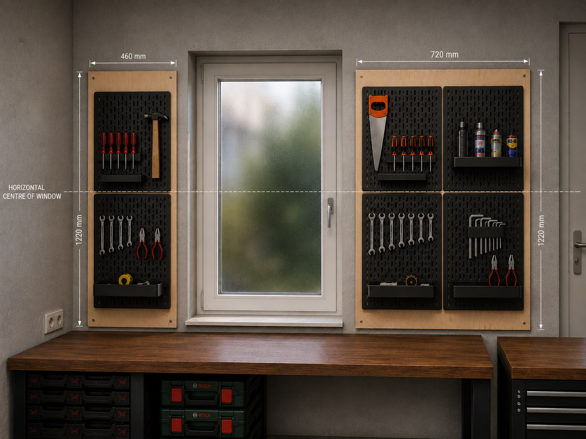

# Garage Layout

Parametric OpenSCAD model used as visual support while making layout and construction choices for a private garage / workshop.

> The model and documentation were developed with the assistance of ChatGPT.

## Visual concept

The image below is an early visual reference for the intended rear-wall tool-board layout. It supports the design discussion, while the OpenSCAD model remains the dimensional reference.



For the generated OpenSCAD views and more detailed visual notes, see [`v1.0/doc/design-overview.md`](v1.0/doc/design-overview.md).


## Project status

This is primarily a **private design and exploration project**, not an attempt to create a complete architectural or photorealistic garage model.

The main goal is to investigate how OpenSCAD can support practical home and workshop design decisions. The model is used to place real dimensions in context, compare alternatives, check proportions and visualize mounting concepts before buying materials or building anything.

Accuracy is therefore focused on the dimensions and details that affect a decision. Other geometry may deliberately remain simplified.

The current model concentrates on the **rear wall of the garage** and the first wall-storage concept around the existing window, door and workbench.


## Visual design overview

An extended visual overview of the current v1.0 model, including the generated OpenSCAD renders and short notes per view, is available here:

- [v1.0 design overview](v1.0/doc/design-overview.md)

## Rear-wall dimensions

| Item | Dimension |
| --- | ---: |
| Rear wall width | 3800 mm |
| Garage height | 2600 mm |
| Modelled concrete wall thickness | 90 mm |
| Current modelled left-wall depth | 2000 mm (temporary) |
| Window opening | 780 × 1340 mm |
| Window offset from left wall | 480 mm |
| Space above window | 200 mm |
| Door height | 2300 mm |
| Workbench | 1500 × 750 × 990 mm |
| Left backing panel | 460 × 1220 × 18 mm |
| Right backing panel | 720 × 1220 × 18 mm |
| SKÅDIS panel | 360 × 560 mm |

Current SKÅDIS arrangement:

- **left:** 1 × 2 panels;
- **right:** 2 × 2 panels.

## Backing-panel material

The SKÅDIS panels will not be mounted directly to the concrete. A wooden backing panel provides a cleaner mounting surface and makes later changes or additional workshop attachments easier.

Two practical sheet materials were considered.

### 18 mm pine plywood — preferred

The current design uses **18 mm pine plywood**.

Example material:

- GAMMA — Multiplex grenen 244 × 122 cm, 18 mm  
  <https://www.gamma.nl/assortiment/multiplex-grenen-244x122cm-dikte-18mm/p/B368216>

Reasons for preferring plywood:

- cleaner visible finish than OSB;
- good screw holding for SKÅDIS rails and later additions;
- easier to machine accurately for the recessed hanging hardware;
- edges can be finished neatly;
- more appropriate for a visible workshop wall that may evolve over time.

### 18 mm OSB3 — alternative

OSB3 was considered as the lower-cost alternative.

Example material:

- GAMMA — OSB3 244 × 122 cm, 18 mm  
  <https://www.gamma.nl/assortiment/osb3-plaat-244-x-122-cm-18-mm-rechte-kanten/p/B112332>

OSB is structurally suitable for this concept, but the rougher appearance, edges and less refined machining make plywood the preferred option here.

### Cutting concept

The required backing panels are:

- **460 × 1220 × 18 mm** — left;
- **720 × 1220 × 18 mm** — right.

Together they require 1180 mm of the 1220 mm sheet width, so both can be cut from a **single 2440 × 1220 mm sheet** with useful material remaining for tests, spacers or other workshop parts.

## SKÅDIS mounting

The intended pegboards are black IKEA SKÅDIS panels in the standard **36 × 56 cm** orientation.

Product reference:

- IKEA SKÅDIS pegboard 36 × 56 cm  
  <https://www.ikea.com/nl/nl/p/skadis-pegboard-zwart-80534372/>

The SKÅDIS boards are mounted to the plywood using their normal wall-mounting principle. The plywood therefore becomes the structural mounting surface instead of the concrete wall.

Each board is represented as an individual component in OpenSCAD, including rounded corners, the slot pattern and visible mounting points. The model keeps the boards separate rather than treating a 2 × 2 arrangement as one large panel.

## Backing-panel suspension

One design requirement is that the plywood should stay **close to the concrete wall** while preferably remaining removable. This ruled out several otherwise useful mounting methods.

### Options considered

#### Wooden French cleat

A traditional 18 mm plywood French cleat would be simple, strong and easy to make.

It was not selected because it would add approximately another 18 mm behind the already 18 mm backing panel, making the complete wall system unnecessarily deep.

#### STAS French cleat hanger

A thin STAS metal French-cleat system was considered because it keeps the mounting compact and removable.

The stated load ratings of the relatively short STAS hangers did not give enough confidence for a workshop panel that may gradually collect heavier tools.

#### Hettich cabinet hanging rail

Hettich cabinet rails were investigated because the wall rail itself is inexpensive, thin and readily available.

The system is primarily intended to work with dedicated cabinet hangers. It was not clear that the matching components offered a simple flat mounting solution for the back of an 18 mm plywood panel, so the system became more complicated than necessary for this application.

#### Button-fix

Button-fix Type 1 was considered because of its high published load capacity and compact installation.

It was rejected mainly because the required individual mounting points on the concrete wall were less attractive for this design than a clean continuous rail.

#### Concealed Ø35 mm panel hangers

Recessed circular concealed hangers were also considered. They can sit almost completely inside 18 mm sheet material and leave little visible hardware.

They remain an interesting alternative, but require several accurately positioned individual wall anchors and more machining per fixing point.

### Selected concept — ROPRO Heavy Duty Z-bar

The current design uses **ROPRO Heavy Duty French Cleat / Z-bar** profiles.

Selected sets:

- left backing panel: **30 cm set**  
  <https://www.ropro.eu/en/heavy-duty-french-cleat-z-bar-set-30cm.html>
- right backing panel: **60 + 6 cm set**  
  <https://www.ropro.eu/en/heavy-duty-french-cleat-z-bar-set-60-6cm.html>

The reasons for choosing this system are:

- metal construction intended for panel suspension;
- compact wall spacing;
- removable panels;
- continuous wall-side support on the larger panel;
- visually clean wall mounting;
- easy to represent and evaluate in the OpenSCAD model.

ROPRO does not publish one universal kilogram rating for these profiles because the actual capacity depends heavily on the wall, anchors, screws and mounted object. For this garage the concrete wall and final fastener selection therefore remain part of the real-world engineering decision.

### Recessed Z-bar concept

The current OpenSCAD model assumes a **6 mm deep routed recess** in the rear of the 18 mm plywood so the mounting profile can be integrated rather than simply spacing the entire panel away from the wall.

That leaves approximately **12 mm of plywood** at the recessed area. Final screw length, screw type and edge distances therefore still need to be selected carefully before construction.

The long wall rail must also be considered in the recess geometry: the routed area needs to provide clearance for the complete rail when the panel is lowered into position, not just for the short panel-side clips.

Small lower spacers or bumpers may be used to keep the panel parallel to the wall. These are suitable candidates for simple 3D-printed project components.

## Preliminary material list

This is a design-stage list rather than a final purchasing specification.

| Qty. | Item | Current specification / size | Notes |
| ---: | --- | --- | --- |
| 1 | Pine plywood sheet | 2440 × 1220 × 18 mm | Cut both backing panels from one sheet |
| 1 | Left backing panel | 460 × 1220 × 18 mm | Cut from plywood sheet |
| 1 | Right backing panel | 720 × 1220 × 18 mm | Cut from plywood sheet |
| 2 | IKEA SKÅDIS | 360 × 560 mm, black | Left side, stacked vertically |
| 4 | IKEA SKÅDIS | 360 × 560 mm, black | Right side, 2 × 2 |
| 1 | ROPRO Heavy Duty Z-bar set | 300 mm | Left backing panel |
| 1 | ROPRO Heavy Duty Z-bar set | 600 + 60 mm | Right backing panel; one 600 mm wall rail and short panel-side sections |
| TBD | Concrete anchors / screws | suitable for 90 mm concrete wall | Final type depends on wall condition and rail hole geometry |
| TBD | Screws for panel-side Z-bars | suitable for 18 mm plywood with 6 mm recess | Must not penetrate front face |
| TBD | SKÅDIS mounting screws | suitable for 18 mm plywood | Use the IKEA mounting geometry |
| 4 approx. | Lower spacers / bumpers | about 6 mm, final size TBD | Potential 3D-printed parts |

## Render and export naming

Render entry-point filenames do not include the project prefix. The GitHub workflow adds the `tool-board-` prefix to generated render and export output, avoiding duplicated names such as `tool-board-tool-board-...`.

Examples:

```text
garage_rear.scad
rear_tool_panels.scad
tool_panel_mounting_exploded.scad
```


## Repository layout

Each model revision has its own CAD sources and generated output.

```text
.
├── README.md
└── v1.0/
    ├── cad/
    │   ├── main.scad
    │   ├── config.scad
    │   ├── model.md
    │   ├── assemblies/
    │   ├── components/
    │   ├── project_components/
    │   ├── exports/
    │   └── renders/
    ├── out/
    │   ├── png/
    │   └── stl/
    └── doc/
```

### `cad/`

Contains the OpenSCAD source for the version.

- `main.scad` — main interactive entry point and Customizer view;
- `config.scad` — dimensions, visibility switches and project configuration;
- `assemblies/` — larger assemblies composed from project components;
- `components/` — reusable generic components;
- `project_components/` — garage-specific components and placement;
- `exports/` — fixed entry points for geometry export;
- `renders/` — fixed entry points for repeatable PNG renders;
- `model.md` — implementation notes specific to the CAD model.

### `out/`

Generated output:

- `out/png/` — rendered images;
- `out/stl/` — exported printable geometry where applicable.

### `doc/`

Version-specific design documentation that does not belong inside the CAD source tree.

## Using the model

Open:

```text
v1.0/cad/main.scad
```

in OpenSCAD for the normal interactive model.

The Customizer contains switches for major visual elements, including the workbench, floor, rear wall, left wall, plywood backing panels and SKÅDIS system. This makes it possible to simplify the scene while evaluating individual design choices.

The files under `renders/` provide repeatable views, while `exports/` contains geometry-oriented entry points.
