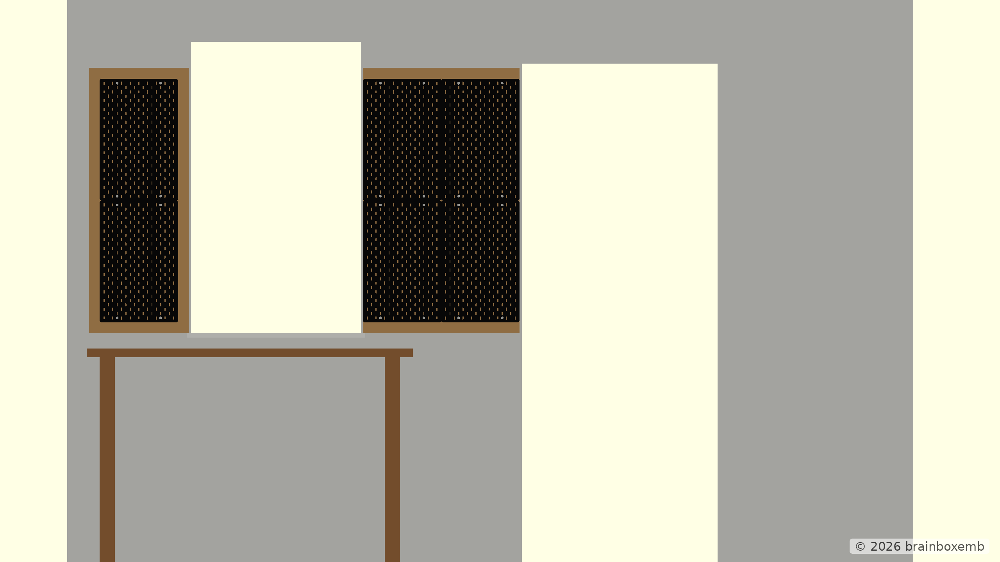
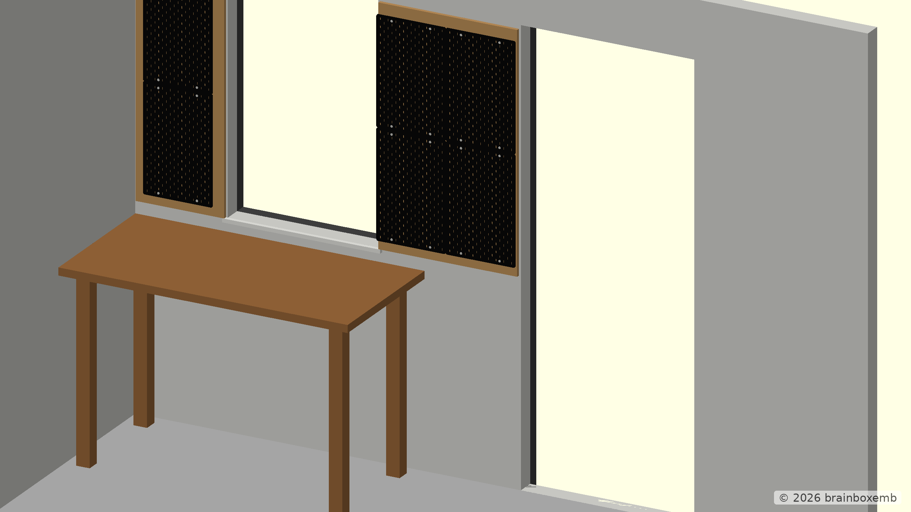
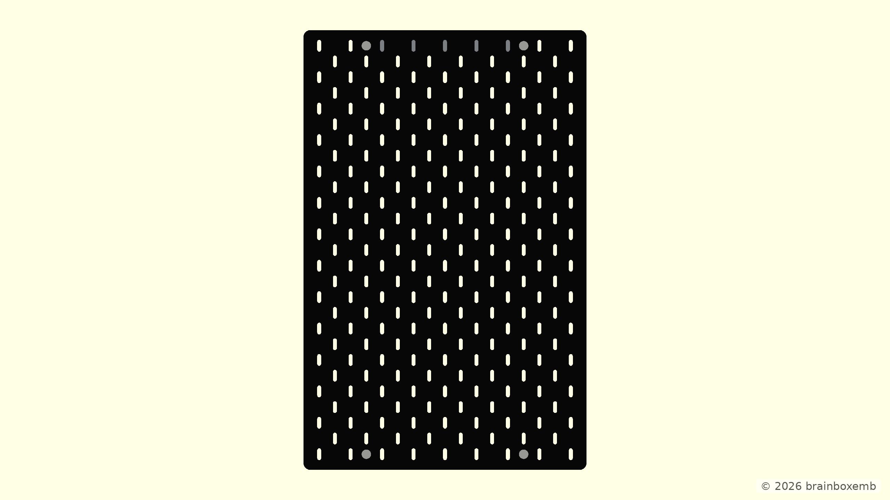

# Design overview — v1.0

This document collects the visual views used to evaluate the current tool-board concept for the rear wall of the garage.

The project is primarily a private design study. The OpenSCAD model is used as a dimensional and visual aid for workshop / home-design choices rather than as a photorealistic room-planning model.

## Concept reference

The following concept image is used as a visual reference for the intended overall appearance. It is not a dimensional CAD render and should not be treated as authoritative geometry.


## Main rear-wall view



This is the primary straight-on OpenSCAD view for checking the relationship between the window, workbench, plywood backing panels and SKÅDIS layout.

## Angled rear-wall view



The angled view is intended to make depth, wall offset and the relationship between the backing panels and surrounding garage geometry easier to judge.

## SKÅDIS component detail



This view shows the reusable SKÅDIS component with its rounded corners, slot pattern and visible mounting points.

## Render generation

The images under `v1.0/out/png/` are generated automatically by the repository's GitHub Actions workflow from the OpenSCAD entry points in:

```text
v1.0/cad/renders/
```

The render entry-point files themselves do not contain the `tool-board-` prefix; the build workflow adds that prefix to the generated PNG filenames.
