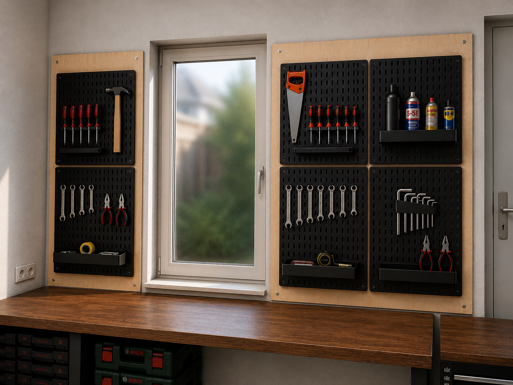
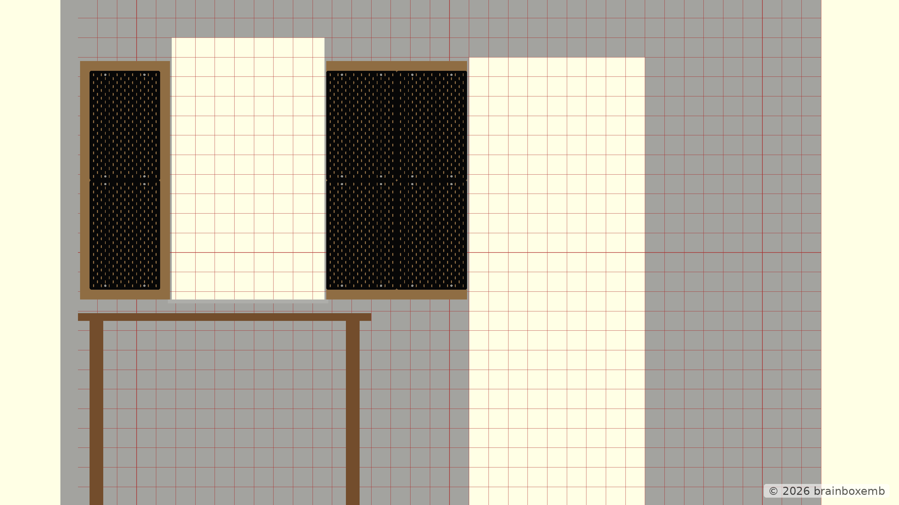

# Design overview — v1.0

This document collects the visual views used to evaluate the current tool-board concept for the rear wall of the garage.

The project is primarily a private design study. The OpenSCAD model is used as a dimensional and visual aid for workshop / home-design choices rather than as a photorealistic room-planning model.

## Concept renders

### Straight concept


### Angled concept



These concept renders communicate the intended appearance and composition. They are not authoritative geometry.

## OpenSCAD implementation

### Straight rear-wall view


This is the primary dimensional view for checking the relationship between the window, workbench, plywood backing panels and SKÅDIS layout.

### Angled rear-wall view


The angled view is taken from inside the garage at approximately standing eye height, looking towards the rear wall. It gives a more natural impression of the tool-board layout and the relationship with the workbench, floor and side wall.

## 100 mm reference-grid view



This render adds a 100 mm reference grid across the rear-wall plane. The grid is a visual measuring aid and can also be enabled interactively from the OpenSCAD Customizer.

The plywood backing panels are aligned with the **top of the window sill**. With the current dimensions, the backing panels run from 1060 mm to 2280 mm above floor level.

## SKÅDIS component detail


This view shows the reusable SKÅDIS component with its rounded corners, slot pattern and visible mounting points.

## Render generation

The images under `v1.0/out/png/` are generated automatically by the repository's GitHub Actions workflow from the OpenSCAD entry points in:

```text
v1.0/cad/renders/
```

The render entry-point files themselves do not contain the `tool-board-` prefix; the build workflow adds that prefix to the generated PNG filenames.
